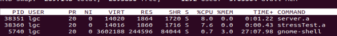
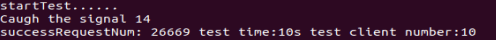
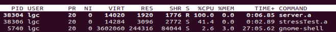
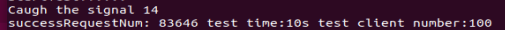
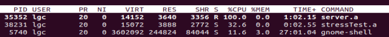
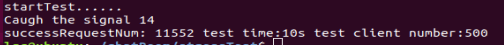
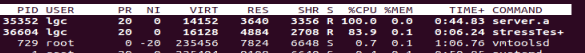
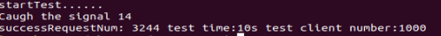

# 简易聊天服务器
## 1 实现的功能
一个游戏中的聊天服务器：
1. 支持多人同时在线聊天
2. 保存最近100条聊天记录
3. 10个客服端的性能测试，测试聊天服务器的最大同时并发请求

## 2 实现方案
&emsp;&emsp;为解决TCP粘包、拆包和消息存储问题。将每条消息的最大长度设置为MSG_LEN（64），简单在每条消息前面加上"0x11+0x22+0x33+消息长度"四个字节作为TCP包头，包头后面再加消息数据组成完整的数据包；客户端请求成功ack的包为“0x11+0x22+0x22+0x00”四个字节。
### 2.1 功能1：支持多人同时在线聊天
&emsp;&emsp;在服务器端使用单线程和epoll监听IO就绪事件，使用一个数组clientDatas保存所有客户的fd等数据，当接收到一个客户端发来的消息，则遍历clientDatas分发消息到每个客户的fd。

&emsp;&emsp;在客户端使用单线程和epoll监听IO就绪事件，同时监听键盘输入和连接socket。键盘输入时，若输入数据小于MSG_LEN - 4，则加上TCP包头再发送到服务器。若长度大于或等于MSG_LEN -4，则自动将消息分段为MSG_LEN - 5的长度，分段后的每条消息补上一个'\0'字符后并加上TCP包头再发送到服务器。同时也会将服务器发来的消息进行拆包之后再打印出来。

### 2.2 功能2：保存最近100条聊天记录
&emsp;&emsp;在服务器使用一个结构体保存最近的100条数据，数据保存在结构体内部的char数组缓存中（循环使用的数组）。每次有新的用户连接时，则发送最近的100条数据给新用户。另外每次关闭服务器时，将该结构体的内存数据以二进制的形式直接保存到一个文件中；每次开启服务器时将文件中的数据以二进制的形式读出到结构体内存。
### 2.3 功能3：性能测试
&emsp;&emsp;使用单线程和epoll监听IO就绪事件，建立TEST_TIME个socket连接，循环使用其中一个socket发送数据到服务器。对于每个socket，每次发送数据到服务器后，需等待服务器返回一个请求成功的消息才能再使用这个socket发送数据到服务器。同时使用时钟信号进行测试时间的控制，当测试时间结束时，通过注册的信号中断函数捕获到该时钟信号，停止测试并输出测试结果。

## 3 测试结果
### 3.1 使用10 个客户端

&emsp;&emsp;由上图可见，服务器程序CPU利用率约为 8.0%， 测试10秒的最大请求数为26669，qps = 2666。这是因为在压力测试程序中：对于每个socket，每次发送数据到服务器后，需等待服务器返回一个请求成功的消息才能再使用这个socket发送数据到服务器。这会造成socket经常处于等待ack状态，造成服务器CPU利用率较低。
### 3.2 使用100 个客户端

&emsp;&emsp;由上图可见，服务器程序CPU利用率约为 100.0%， 测试10秒的最大请求数为83646，qps = 8364。因为在压力测试程序中打开的客户端较多，当某些socket在等待请求成功信息时，可以只用其它未处于等待ack状态的socket发送请求到服务器，所以服务器CPU利用率达100.0%。
### 3.3 使用500 个客户端

&emsp;&emsp;由上图可见，服务器程序CPU利用率约为 100.0%， 测试10秒的最大请求数为11552，qps = 1155。虽然服务器CPU利用率达100.0%，但是qps较低。这是因为服务器连接的客户端数量过多，每接收到一个用户的信息时，要分发给499个用户，导致处理一个请求的速度较慢。
### 3.4 使用1000个客户端

&emsp;&emsp;由上图可见，服务器程序CPU利用率约为 100.0%， 测试10秒的最大请求数为3244，qps = 324。服务器CPU利用率同样是100.0%，但是qps更低了。这是因为服务器连接的客户端数量过多，每接收到一个用户的信息时，要分发给999个用户，导致处理一个请求的速度较慢。

## 代码文件介绍
#### server文件夹保存的是服务器的代码
server/myServerEntry.cpp： 是服务器入口代码，里面有main函数，功能主要是创建MyServer实例、注册时钟信号、通过MyServer实例开启服务器等。

server/myServe.h：声明MyServer类的各种成员变量和成员函数。

server/myServe.cpp： MyServer类的成员函数实现。

server/makefile： 编译文件

#### stessTest文件夹保存的是性能测试的代码
stessTest/testEntry.cpp： 是测试入口代码，里面有main函数，功能主要是创建StressTest实例、注册关闭信号、通过StressTest实例开始性能测试。

stessTest/stressTest.h： 声明StressTest类的各种成员变量和成员函数。

stessTest/stressTest.cpp： StressTest类的成员函数实现。

stessTest/makefile： 编译文件

#### client文件夹保存的是客户端的代码
client/myClient.cpp： main函数入口，功能主要是建立服务器连接，监听用户输入及连接socket状态，将用户输入进行处理后发送到服务器和将服务器发来的消息处理后打印出来。

client/makefile： 编译文件

